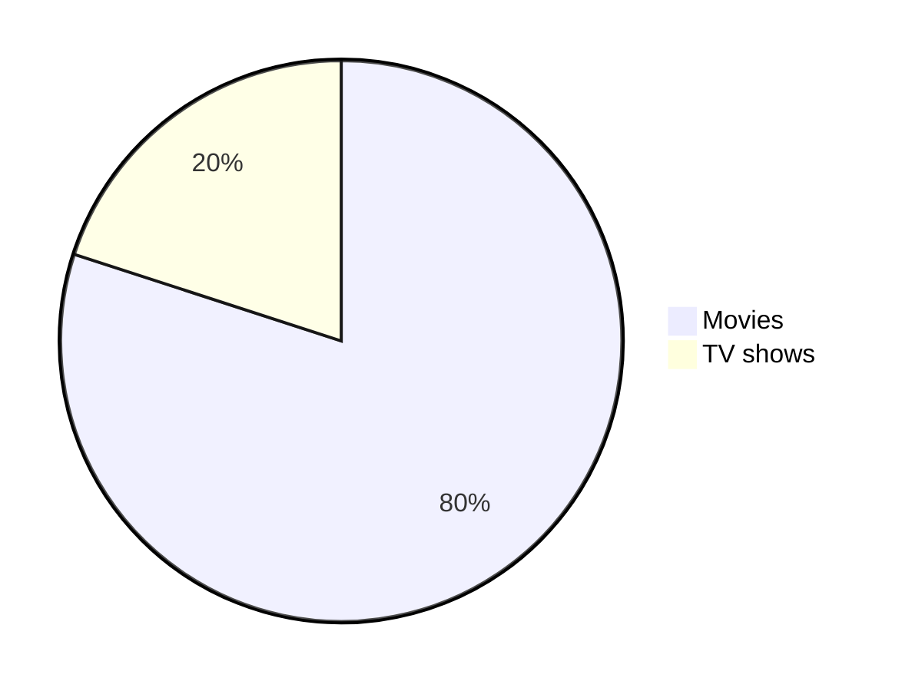

<h1 align="center">
  :duck: Markdown :duck:
</h1>

<a name="top"></a>

<br/>

> [!IMPORTANT]
> This is a markdown document to learn more about writing and formatting syntax.

{:toc}

# Introduction

Markdown is a way of writing rich-text (formatted text) content using plain text formatting syntax. It is also a tool that converts the plain text formatting to HTML.

- **2004:** [John Gruber](https://daringfireball.net/projects/markdown/) developed Markdown.
- **2014:** [CommonMark](https://commonmark.org/) was established as a standard specification for Markdown to resolve inconsistencies and ambiguities in Markdown implementations. This initiative was backed by other Markdown enthusiasts to ensure a reliable and consistent specification.

# Headings

```md
# Heading 1
## Heading 2
### Heading 3
#### Heading 4
##### Heading 5
###### Heading 6
```
<!-- omit in toc -->
# Heading 1
<!-- omit in toc -->
## Heading 2
<!-- omit in toc -->
### Heading 3
<!-- omit in toc -->
#### Heading 4
<!-- omit in toc -->
##### Heading 5
<!-- omit in toc -->
###### Heading 6

```md
<h1>Heading 1</h1>
<h2>Heading 2</h2>
<h3>Heading 3</h3>
<h4>Heading 4</h4>
<h5>Heading 5</h5>
<h6>Heading 6</h6>
```

<!-- omit in toc -->
<h1>Heading 1</h1>
<!-- omit in toc -->
<h2>Heading 2</h2>
<!-- omit in toc -->
<h3>Heading 3</h3>
<!-- omit in toc -->
<h4>Heading 4</h4>
<!-- omit in toc -->
<h5>Heading 5</h5>
<!-- omit in toc -->
<h6>Heading 6</h6>

```md
Heading 1
=
Heading 2
-
```

<!-- omit in toc -->
Heading 1 <!-- markdownlint-disable MD003 -->
=
<!-- omit in toc -->
Heading 2 <!-- markdownlint-disable MD003 -->
-

# Text styles

## Normal

```md
The quick brown fox jumps over the lazy dog.
```

The quick brown fox jumps over the lazy dog.

## Bold

Mac: <kbd>command+B</kbd>

Windows: <kbd>control+B</kbd>

```md
**The quick brown fox jumps over the lazy dog.**
__The quick brown fox jumps over the lazy dog.__
<strong>The quick brown fox jumps over the lazy dog.</strong>
```

**The quick brown fox jumps over the lazy dog.**

<!-- markdownlint-disable-next-line MD050 -->
__The quick brown fox jumps over the lazy dog.__

<strong>The quick brown fox jumps over the lazy dog.</strong>

## Italic

Mac: <kbd>command+I</kbd>

Windows: <kbd>control+I</kbd>

```md
*The quick brown fox jumps over the lazy dog.*
_The quick brown fox jumps over the lazy dog._
<em>The quick brown fox jumps over the lazy dog.</em>
```

*The quick brown fox jumps over the lazy dog.*

<!-- markdownlint-disable-next-line MD049 -->
_The quick brown fox jumps over the lazy dog._

<em>The quick brown fox jumps over the lazy dog.</em>

## Bold and Italic

```md
**_The quick brown fox jumps over the lazy dog._**
<strong><em>The quick brown fox jumps over the lazy dog.</em></strong>
```
<!-- markdownlint-disable-next-line MD049 -->
**_The quick brown fox jumps over the lazy dog._**

<strong><em>The quick brown fox jumps over the lazy dog.</em></strong>

## Blockquotes

Mac: <kbd>command+shift+.</kbd>

Windows: <kbd>control+shift+.</kbd>

```md
> The quick brown fox jumps over the lazy dog.

<br>

> The quick brown fox jumps over the lazy dog.
>
> The quick brown fox jumps over the lazy dog.
>
> The quick brown fox jumps over the lazy dog.

<br>

> The quick brown fox jumps over the lazy dog.
>> The quick brown fox jumps over the lazy dog.
>>> The quick brown fox jumps over the lazy dog.

<br>

> **The quick brown fox** *jumps over the lazy dog.*
```

> The quick brown fox jumps over the lazy dog.

<br>

> The quick brown fox jumps over the lazy dog.
>
> The quick brown fox jumps over the lazy dog.
>
> The quick brown fox jumps over the lazy dog.

<br>

> The quick brown fox jumps over the lazy dog.
>> The quick brown fox jumps over the lazy dog.
>>> The quick brown fox jumps over the lazy dog.

<br>

> **The quick brown fox** *jumps over the lazy dog.*

## Monospaced

```md
<samp>The quick brown fox jumps over the lazy dog.</samp>
```

<samp>The quick brown fox jumps over the lazy dog.</samp>

## Underlined

```md
<ins>The quick brown fox jumps over the lazy dog.</ins>
```

<ins>The quick brown fox jumps over the lazy dog.</ins>

## Strike-through

```md
~~The quick brown fox jumps over the lazy dog.~~
```

~~The quick brown fox jumps over the lazy dog.~~

```md
<pre>
Lorem ipsum dolor sit amet, consectetur adipiscing elit. <strike>Sed do eiusmod tempor incididunt ut labore et dolore magna
aliqua.</strike> Ut enim ad minim veniam, quis nostrud exercitation ullamco laboris nisi ut aliquip ex ea commodo consequat.
Duis aute irure dolor in reprehenderit in voluptate velit esse cillum dolore eu fugiat nulla pariatur. <strike>Excepteur sint
occaecat cupidatat non proident, sunt in culpa qui officia deserunt mollit anim id est laborum.</strike>
</pre>
```

<pre>
Lorem ipsum dolor sit amet, consectetur adipiscing elit. <strike>Sed do eiusmod tempor incididunt ut labore et dolore magna
aliqua.</strike> Ut enim ad minim veniam, quis nostrud exercitation ullamco laboris nisi ut aliquip ex ea commodo consequat.
Duis aute irure dolor in reprehenderit in voluptate velit esse cillum dolore eu fugiat nulla pariatur. <strike>Excepteur sint
occaecat cupidatat non proident, sunt in culpa qui officia deserunt mollit anim id est laborum.</strike>
</pre>

````md
<strike>

```js
console.log('Error');
```

</strike>
````

<strike>

```js
console.log('Error');
```

</strike>

## Boxed

```md
<table><tr><td>The quick brown fox jumps over the lazy dog.</td></tr></table>
```

<table><tr><td>The quick brown fox jumps over the lazy dog.</td></tr></table>

## Subscript

```md
log<sub>2</sub>(x)
Subscript <sub>The quick brown fox jumps over the lazy dog.</sub>
```

log<sub>2</sub>(x)

Subscript <sub>The quick brown fox jumps over the lazy dog.</sub>

## Superscript

```md
2 <sup>53-1</sup> and -2 <sup>53-1</sup>
Superscript <sup>The quick brown fox jumps over the lazy dog.</sup>
```

2 <sup>53-1</sup> and -2 <sup>53-1</sup>

Superscript <sup>The quick brown fox jumps over the lazy dog.</sup>

## Text Color

Using [MathJax](#mathematical-expressions) syntax:

| Color Name      | Code                                                                                         | Example                                                        |
|-----------------|----------------------------------------------------------------------------------------------|----------------------------------------------------------------|
| Apricot         | `$\color{Apricot}{The\ quick\ brown\ fox\ jumps\ over\ the\ lazy\ dog.}$`                    | $\color{Apricot}{The\ quick\ brown\ fox\ jumps\ over\ the\ lazy\ dog.}$      |
| Aquamarine      | `$\color{Aquamarine}{The\ quick\ brown\ fox\ jumps\ over\ the\ lazy\ dog.}$`                 | $\color{Aquamarine}{The\ quick\ brown\ fox\ jumps\ over\ the\ lazy\ dog.}$   |
| Bittersweet     | `$\color{Bittersweet}{The\ quick\ brown\ fox\ jumps\ over\ the\ lazy\ dog.}$`                | $\color{Bittersweet}{The\ quick\ brown\ fox\ jumps\ over\ the\ lazy\ dog.}$  |
| Black           | `$\color{Black}{The\ quick\ brown\ fox\ jumps\ over\ the\ lazy\ dog.}$`                      | $\color{Black}{The\ quick\ brown\ fox\ jumps\ over\ the\ lazy\ dog.}$        |


## Multiline

The quick\
brown fox\
jumps over\
the lazy dog.

```md
The quick\
brown fox\
jumps over\
the lazy dog.
```

# Syntax Highlighting

## Inline code

A class method is an instance method of the class object. When a new class is created, an object of type `Class` is initialized and assigned to a global constant (Mobile in this case).

You can use <kbd>command + e </kbd> on Mac or <kbd>control + e</kbd> on Windows to insert inline code.

## Code block

<!-- markdownlint-disable MD040 -->

```
public static String monthNames[] = {"January", "February", "March", "April", "May", "June", "July", "August", "September", "October", "November", "December"};
```

<!-- markdownlint-enable MD040 -->

````md
```
public static String monthNames[] = {"January", "February", "March", "April", "May", "June", "July", "August", "September", "October", "November", "December"};
```
````

```java
public static String monthNames[] = {"January", "February", "March", "April", "May", "June", "July", "August", "September", "October", "November", "December"};
```

````md
```java
public static String monthNames[] = {"January", "February", "March", "April", "May", "June", "July", "August", "September", "October", "November", "December"};
```
````

## Diff Code block

```diff
## git diff a/test.txt b/test.txt
diff --git a/a/test.txt b/b/test.txt
index 309ee57..c995021 100644
--- a/a/test.txt
+++ b/b/test.txt
@@ -1,8 +1,6 @@
-The quick brown fox jumps over the lazy dog
+The quick brown fox jumps over the lazy cat

 a
-b
 c
 d
-e
 f
```

````md
```diff
## git diff a/test.txt b/test.txt
diff --git a/a/test.txt b/b/test.txt
index 309ee57..c995021 100644
--- a/a/test.txt
+++ b/b/test.txt
@@ -1,8 +1,6 @@
-The quick brown fox jumps over the lazy dog
+The quick brown fox jumps over the lazy cat

 a
-b
 c
 d
-e
 f
```
````

```diff
- Text in Red
+ Text in Green
! Text in Orange
# Text in Gray
@@ Text in Purple and bold @@
```

````md
```diff
- Text in Red
+ Text in Green
! Text in Orange
# Text in Gray
@@ Text in Purple and bold @@
```
````

# Alignments

```md
<p align="left">

</p>
```

<p align="left">
<!-- markdownlint-disable-next-line MD013 -->

</p>

```md
<p align="center">

</p>
```

<p align="center">
<!-- markdownlint-disable-next-line MD013 -->

</p>

```md
<p align="right">

</p>
```

<p align="right">
<!-- markdownlint-disable-next-line MD013 -->

</p>

```md
<h3 align="center"> My latest Medium posts </h3>
```

<!-- omit in toc -->
<h3 align="center"> My latest Medium posts </h3>

# Tables

```md
<table>
<tr>
<td width="33%"">
The quick brown fox jumps over the lazy dog.
</td>
<td width="33%">
The quick brown fox jumps over the lazy dog.
</td>
<td width="33%">
The quick brown fox jumps over the lazy dog.
</td>
</tr>
</table>
```

<table>
<tr>
<td width="33%"">
The quick brown fox jumps over the lazy dog.
</td>
<td width="33%">
The quick brown fox jumps over the lazy dog.
</td>
<td width="33%">
The quick brown fox jumps over the lazy dog.
</td>
</tr>
</table>

```md
| Default | Left align | Center align | Right align |
| - | :- | :-: | -: |
| 9999999999 | 9999999999 | 9999999999 | 9999999999 |
| 999999999 | 999999999 | 999999999 | 999999999 |
| 99999999 | 99999999 | 99999999 | 99999999 |
| 9999999 | 9999999 | 9999999 | 9999999 |

| Default    | Left align | Center align | Right align |
| ---------- | :--------- | :----------: | ----------: |
| 9999999999 | 9999999999 | 9999999999   | 9999999999  |
| 999999999  | 999999999  | 999999999    | 999999999   |
| 99999999   | 99999999   | 99999999     | 99999999    |
| 9999999    | 9999999    | 9999999      | 9999999     |

Default    | Left align | Center align | Right align
---------- | :--------- | :----------: | ----------:
9999999999 | 9999999999 | 9999999999   | 9999999999
999999999  | 999999999  | 999999999    | 999999999
99999999   | 99999999   | 99999999     | 99999999
9999999    | 9999999    | 9999999      | 9999999
```

| Default | Left align | Center align | Right align |
| - | :- | :-: | -: |
| 9999999999 | 9999999999 | 9999999999 | 9999999999 |
| 999999999 | 999999999 | 999999999 | 999999999 |
| 99999999 | 99999999 | 99999999 | 99999999 |
| 9999999 | 9999999 | 9999999 | 9999999 |

| Default    | Left align | Center align | Right align |
| ---------- | :--------- | :----------: | ----------: |
| 9999999999 | 9999999999 | 9999999999   | 9999999999  |
| 999999999  | 999999999  | 999999999    | 999999999   |
| 99999999   | 99999999   | 99999999     | 99999999    |
| 9999999    | 9999999    | 9999999      | 9999999     |

<!-- markdownlint-disable MD055 -->
Default    | Left align | Center align | Right align
---------- | :--------- | :----------: | ----------:
9999999999 | 9999999999 | 9999999999   | 9999999999
999999999  | 999999999  | 999999999    | 999999999
99999999   | 99999999   | 99999999     | 99999999
9999999    | 9999999    | 9999999      | 9999999
<!-- markdownlint-enable MD055 -->

```md
<table>
<tr>
<th>Heading 1</th>
<th>Heading 2</th>
</tr>
<tr>

<td>

| A | B | C |
|--|--|--|
| 1 | 2 | 3 |

</td><td>

| A | B | C |
|--|--|--|
| 1 | 2 | 3 |

</td></tr> </table>
```

<table>
<tr>
<th>Heading 1</th>
<th>Heading 2</th>
</tr>
<tr>

<td>

| A | B | C |
|--|--|--|
| 1 | 2 | 3 |

</td><td>

| A | B | C |
|--|--|--|
| 1 | 2 | 3 |

</td></tr> </table>

```md
| A | B | C |
|---|---|---|
| 1 | 2 | 3 <br/> 4 <br/> 5 |
```

| A | B | C |
|---|---|---|
| 1 | 2 | 3 <br/> 4 <br/> 5 |

```md
<table>
<tr>
<th>Before Hoisting</th>
<th>After Hoisting</th>
</tr>
<tr>
<td>
<pre lang="js">
console.log(fullName); // undefined
fullName = "ABC XYZ";
console.log(fullName); // ABC XYZ
var fullName;
</pre>
</td>
<td>
<pre lang="js">
var fullName;
console.log(fullName); // undefined
fullName = "ABC XYZ";
console.log(fullName); // ABC XYZ
</pre>
</td>
</tr>
</table>
```

<table>
<tr>
<th>Before Hoisting</th>
<th>After Hoisting</th>
</tr>
<tr>
<td>
<pre lang="js">
console.log(fullName); // undefined
fullName = "ABC XYZ";
console.log(fullName); // ABC XYZ
var fullName;
</pre>
</td>
<td>
<pre lang="js">
var fullName;
console.log(fullName); // undefined
fullName = "ABC XYZ";
console.log(fullName); // ABC XYZ
</pre>
</td>
</tr>
</table>

# Links

## Inline

```md
[The-GNU-Project](https://gnu.org)
```

[The-GNU-Project](https://gnu.org)

## Reference

```md
[The-GNU-Project][reference text]

[The-GNU-Project][1]

[Markdown-Cheat-Sheet]

[reference text]: https://#
[1]: https://#
[Markdown-Cheat-Sheet]: https://#
```

[The-GNU-Project][reference text]

[The-GNU-Project][1]

[Markdown-Cheat-Sheet]

[reference text]: https://gnu.org
[1]: https://gnu.org
[Markdown-Cheat-Sheet]: https://gnu.org

## Footnote

Footnote.[^1]

Some other important footnote.[^2]

[^1]: This is footnote number one.
[^2]: Here is the second footnote.

```md
Footnote.[^1]

Some other important footnote.[^2]

[^1]: This is footnote number one.
[^2]: Here is the second footnote.
```

## Relative

```md
[Example of a relative link](LICENSE.md)
```

[Example of a relative link](LICENSE.md)

## Auto

```md
Visit https://gnu.org/
```

Visit https://gnu.org/

```md
Email at example@example.com
```

Email at example@example.com

## Section

Hello hi bye bye!

## Hover

This is example and [GNU](https://gnu.org/gnu) in markdown.

<!-- markdownlint-disable MD051 -->
This is example and [GNU](## gnu) in markdown.

## Enclosed

```md
<https://gnu.org/>
```

<https://gnu.org/>

## Highlight words and link it to a URL

```md
[GNU](https://gnu.org/)
```

[GNU](https://gnu.org/)

# Images

Alt text and title are optional.

```md

```


```md
![alt text][image]

[image]: https://images.unsplash.com/photo-1415604934674-561df9abf539?ixlib=rb-1.2.1&ixid=eyJhcHBfaWQiOjEyMDd9&auto=format&fit=crop&w=100&q=80 "Title text"
```

![alt text][image]

[image]: https://images.unsplash.com/photo-1415604934674-561df9abf539?ixlib=rb-1.2.1&ixid=eyJhcHBfaWQiOjEyMDd9&auto=format&fit=crop&w=100&q=80 "Title text"

```md

```

<!-- markdownlint-disable-next-line MD013 -->


```md

```


[](https://media.giphy.com/media/qLHzYjlA2FW8g/giphy.gif)

```md
[](https://media.giphy.com/media/qLHzYjlA2FW8g/giphy.gif)
```

<!-- markdownlint-disable-next-line MD013 -->
<a href='https://media.giphy.com/media/qLHzYjlA2FW8g/giphy.gif' target='_blank'>  </a>

```md
<a href='https://media.giphy.com/media/qLHzYjlA2FW8g/giphy.gif' target='_blank'>  </a>
```

## Theme

### Using picture tag

The HTML `<picture>` element, along with the `prefers-color-scheme` media feature, enables you to dynamically adjust images according to the user's color scheme preference, providing options for both light and dark modes.

For example, the code snippet below demonstrates how to display a dark-themed BinaryTree logo when the user's device is set to a dark mode, and a light-themed BinaryTree logo for light mode settings:

```md
<picture>
  <source media="(prefers-color-scheme: dark)" srcset="https://images.unsplash.com/photo-1415604934674-561df9abf539?ixlib=rb-1.2.1&ixid=eyJhcHBfaWQiOjEyMDd9&auto=format&fit=crop&w=2772&q=80">
  <source media="(prefers-color-scheme: light)" srcset="https://images.unsplash.com/photo-1415604934674-561df9abf539?ixlib=rb-1.2.1&ixid=eyJhcHBfaWQiOjEyMDd9&auto=format&fit=crop&w=2772&q=80">
  
</picture>
```

<picture>
  <source media="(prefers-color-scheme: dark)" srcset="https://images.unsplash.com/photo-1415604934674-561df9abf539?ixlib=rb-1.2.1&ixid=eyJhcHBfaWQiOjEyMDd9&auto=format&fit=crop&w=2772&q=80">
  <source media="(prefers-color-scheme: light)" srcset="https://images.unsplash.com/photo-1415604934674-561df9abf539?ixlib=rb-1.2.1&ixid=eyJhcHBfaWQiOjEyMDd9&auto=format&fit=crop&w=2772&q=80">
  
</picture>

### Using dark and light mode

```md
[![Badge][Logo-dark]](https://github-readme-stats.vercel.app/api?username=mysrcs&theme=graywhite&show_icons=true#gh-light-mode-only)
[![Badge][Logo-light]](https://github-readme-stats.vercel.app/api?username=mysrcs&theme=dark&show_icons=true#gh-dark-mode-only)

[Logo-dark]: https://github-readme-stats.vercel.app/api?username=mysrcs&theme=graywhite&show_icons=true#gh-light-mode-only
[Logo-light]: https://github-readme-stats.vercel.app/api?username=mysrcs&theme=dark&show_icons=true#gh-dark-mode-only
```

[![Badge][Logo-dark]](https://github-readme-stats.vercel.app/api?username=mysrcs&theme=graywhite&show_icons=true#gh-light-mode-only)
[![Badge][Logo-light]](https://github-readme-stats.vercel.app/api?username=mysrcs&theme=dark&show_icons=true#gh-dark-mode-only)

[Logo-light]: https://github-readme-stats.vercel.app/api?username=mysrcs&theme=graywhite&show_icons=true#gh-light-mode-only
[Logo-dark]: https://github-readme-stats.vercel.app/api?username=mysrcs&theme=dark&show_icons=true#gh-dark-mode-only

```md
<a href="https://github.com/mysrcs/github-readme-stats#gh-light-mode-only">
  
</a>
<a href="https://github.com/mysrcs/github-readme-stats#gh-dark-mode-only">
  
</a>
```

<a href="https://github.com/mysrcs/github-readme-stats#gh-light-mode-only">
  
</a>
<a href="https://github.com/mysrcs/github-readme-stats#gh-dark-mode-only">
  
</a>

# Badges

```md

```


# Lists

## Ordered

Mac: <kbd>command+shift+7</kbd>

Windows: <kbd>control+shift+7</kbd>

```md
1. One
2. Two
3. Three
```

1. One
2. Two
3. Three

```md
1. First level
    1. Second level
        - Third level
            - Fourth level
2. First level
    1. Second level
3. First level
    1. Second level
```

1. First level
    1. Second level
        - Third level
            - Fourth level
2. First level
    1. Second level
3. First level
    1. Second level

## Unordered

Mac: <kbd>command+shift+8</kbd>

Windows: <kbd>control+shift+8</kbd>

```md
* 1
* 2
* 3

+ 1
+ 2
+ 3


- 1
- 2
- 3
```

<!-- markdownlint-disable MD004 -->

* 1
* 2
* 3

+ 1
+ 2
+ 3

<!-- markdownlint-enable MD004 -->

- 1
- 2
- 3

```md
- First level
  - Second level
    - Third level
      - Fourth level
- First level
  - Second level
- First level
  - Second level
```

- First level
  - Second level
    - Third level
      - Fourth level
- First level
  - Second level
- First level
  - Second level

```md
<ul>
<li>First item</li>
<li>Second item</li>
<li>Third item</li>
<li>Fourth item</li>
</ul>
```

<ul>
<li>First item</li>
<li>Second item</li>
<li>Third item</li>
<li>Fourth item</li>
</ul>

## Task

```md
- [x] Fix Bug 223
- [ ] Add Feature 33
- [ ] Add unit tests
```

- [x] Fix Bug 223
- [ ] Add Feature 33
- [ ] Add unit tests

# Buttons

```md
<kbd>cmd + shift + p</kbd>
```

<kbd>cmd + shift + p</kbd>

```md
<kbd> <br> cmd + shift + p <br> </kbd>
```

<kbd> <br> cmd + shift + p <br> </kbd>

```md
<kbd>[My-Site](https://github.com/mysrcs/mysrcs.github.io)</kbd>
```

<kbd>[My-Site](https://github.com/mysrcs/mysrcs.github.io)</kbd>

```md
[<kbd>My-Site</kbd>](https://github.com/mysrcs/mysrcs.github.io)
```

[<kbd>My-Site</kbd>](https://github.com/mysrcs/mysrcs.github.io)

## Button with emoji

<!-- markdownlint-disable-next-line MD013 -->
<kbd> <br> [My-Site](https://github.com/mysrcs/mysrcs.github.io) ↗️ <br> </kbd>

```md
<kbd> <br> [My-Site](https://github.com/mysrcs/mysrcs.github.io) ↗️ <br> </kbd>
```

# Collapsible items

```md
<details>
  <summary>Markdown</summary>

-  <kbd>[Markdown](/#markdown)</kbd>
-  <kbd>[Table Of Content](/#toc)</kbd>
-  <kbd>[Markdown Table](/#table)</kbd>

</details>
```

<details>
  <summary>Markdown</summary>

- <kbd>[Markdown](#markdown)</kbd>
- <kbd>[Table Of Content](#toc)</kbd>
- <kbd>[Markdown Table](#table)</kbd>

</details>

# Horizontal Rule

```md
---
***
___
```

---

<!-- markdownlint-disable-next-line MD035 -->
***

<!-- markdownlint-disable-next-line MD035 -->
___

# Diagrams

````md

````


# Mathematical expressions

> [!IMPORTANT]
> The MathJax syntax.

```md
This is an inline math expression $x = {-b \pm \sqrt{b^2-4ac} \over 2a}$
```

This is an inline math expression $x = {-b \pm \sqrt{b^2-4ac} \over 2a}$

```md
$$
x = {-b \pm \sqrt{b^2-4ac} \over 2a}
$$
```

$$
x = {-b \pm \sqrt{b^2-4ac} \over 2a}
$$

# Alerts

```md
> [!NOTE]
> Essential details that users should not overlook, even when browsing quickly.

<br>

> [!TIP]
> Additional advice to aid users in achieving better outcomes.

<br>

> [!IMPORTANT]
> Vital information required for users to attain success.

<br>

> [!WARNING]
> Urgent content that requires immediate user focus due to possible risks.

<br>

> [!CAUTION]
> Possible negative outcomes resulting from an action.
```

> [!NOTE]
> Essential details that users should not overlook, even when browsing quickly.

<br>

> [!TIP]
> Additional advice to aid users in achieving better outcomes.

<br>

> [!IMPORTANT]
> Vital information required for users to attain success.

<br>

> [!WARNING]
> Urgent content that requires immediate user focus due to possible risks.

<br>

> [!CAUTION]
> Possible negative outcomes resulting from an action.

# Color models

Test:

```md
`#ffffff`
`#000000`
```
`#ffffff`
`#000000`

# Code

In titles.

### `TEST` Test

```md

### `TEST` Test

```

# Reference Labels

Labels referenced by URLs in Markdown are now automatically rendered.

https://github.com/mysrcs

```md
https://github.com/mysrcs
```

# Miscellaneous

## Comments

<!--
Lorem ipsum dolor sit amet
-->

```md
<!--
Lorem ipsum dolor sit amet
-->
```

## Escaping Markdown Characters

- **Before escaping**

```md
* Asterisk
\ Backslash
` Backtick
{} Curly braces
. Dot
! Exclamation mark
# Hash symbol

- Hyphen symbol

() Parentheses

+ Plus symbol

[] Square brackets
_ Underscore`
```

* Asterisk <!-- markdownlint-disable-line MD004 -->
\ Backslash
` Backtick
{} Curly braces
. Dot
! Exclamation mark
<!-- omit in toc -->
# Hash symbol <!-- markdownlint-disable-line MD022 -->

- Hyphen symbol

() Parentheses

+ Plus symbol <!-- markdownlint-disable-line MD004 -->

[] Square brackets
_ Underscore

- **After escaping**

```md
\* Asterisk
\\ Backslash
\` Backtick
\{} Curly braces
\. Dot
\! Exclamation mark
\# Hash symbol
\- Hyphen symbol
\() Parentheses
\+ Plus symbol
\[] Square brackets
\_ Underscore
```

\* Asterisk
\\ Backslash
\` Backtick
\{} Curly braces
\. Dot
\! Exclamation mark
\# Hash symbol
\- Hyphen symbol
\() Parentheses
\+ Plus symbol
\[] Square brackets
\_ Underscore

## Emojis

```md
:pencil:
```

:pencil:

## Line break

<!-- markdownlint-disable-next-line MD038 -->
You can use `<br>` to insert a single line break. Make sure to use an em space ` `. For example:

```md
<table><tr><td> <br> The quick brown fox jumps over the lazy dog. <br> </td></tr></table>
```

<table><tr><td> <br> The
 quick brown fox jumps over the lazy
  dog. <br> </td></tr></table>

Or

```md
<table><tr><td> <br><br><br> The quick brown fox jumps over the lazy dog. <br><br><br> </td></tr></table>
```

<table><tr><td> <br><br><br> The
 quick brown fox jumps over the lazy
  dog. <br><br><br> </td></tr></table>

## Back to top

First place the following code at start of your markdown file

```md
<a name="top"></a>
```

Then use one of the following code at the place you want to return to top.

[Back to top](#top)

[:arrow_up:](#top)

```md
[Back to top](#top)

[:arrow_up:](#top)
```

# MDX

You can write JSX in your markdown document using [MDX](https://mdxjs.com/).

# Tools

1. Create an empty Markdown table - [Tablesgenerator](https://www.tablesgenerator.com/markdown_tables)
2. Convert Excel to Markdown table - [Tableconvert](https://tableconvert.com/)
3. Markdown preview for Sublime Text 3 - [Packagecontrol](https://packagecontrol.io/packages/MarkdownPreview)
4. Markdown preview Visual Studio Code - [Markdown Preview Enhanced](https://marketplace.visualstudio.com/items?itemName=shd101wyy.markdown-preview-enhanced)
5. Markdownlint - [markdownlint](https://github.com/DavidAnson/markdownlint), [markdownlint-cli2](https://github.com/DavidAnson/markdownlint-cli2), [markdownlint-cli2-action](https://github.com/DavidAnson/markdownlint-cli2-action), [vscode-markdownlint](https://marketplace.visualstudio.com/items?itemName=DavidAnson.vscode-markdownlint)

---

<div align="center">

  The End.

</div>
